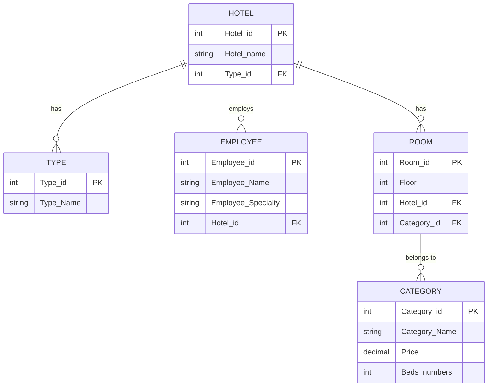

# Hotel Management System - Relational Diagram

This README provides the **relational diagram** for a hotel management system based on the provided Entity-Relationship Model (ERD). The goal is to map the entities, attributes, and relationships into a structured database schema using tables, primary keys, and foreign keys.

---

## Entities and Attributes

1. **Hotel**
   - `Hotel_id` (Primary Key)
   - `Hotel_name`

2. **Type**
   - `Type_id` (Primary Key)
   - `Type_Name`

3. **Employee**
   - `Employee_id` (Primary Key)
   - `Employee_Name`
   - `Employee_Specialty`

4. **Room**
   - `Room_id` (Primary Key)
   - `Floor`

5. **Category**
   - `Category_id` (Primary Key)
   - `Category_Name`
   - `Price`
   - `Beds_numbers`

---

## Relationships

1. **Hotel - Type (1:1)**:
   - A hotel has one type.
   - A type belongs to one hotel.
   - Implemented by adding `Type_id` as a foreign key in the `Hotel` table.

2. **Hotel - Employee (1:N)**:
   - A hotel has many employees.
   - An employee works for one hotel.
   - Implemented by adding `Hotel_id` as a foreign key in the `Employee` table.

3. **Room - Category (1:1)**:
   - A room belongs to one category.
   - A category can be assigned to many rooms.
   - Implemented by adding `Category_id` as a foreign key in the `Room` table.

4. **Hotel - Room (1:N)**:
   - A hotel has many rooms.
   - A room belongs to one hotel.
   - Implemented by adding `Hotel_id` as a foreign key in the `Room` table.

---

## Relational Diagram (Tables and Relationships)

### 1. **Hotel Table**
```sql
CREATE TABLE Hotel (
    Hotel_id INT PRIMARY KEY,      -- Primary Key
    Hotel_name VARCHAR(100) NOT NULL, -- Hotel Name
    Type_id INT,                   -- Foreign Key referencing Type
    FOREIGN KEY (Type_id) REFERENCES Type(Type_id) -- Relationship: Hotel has a Type
);
CREATE TABLE Type (
    Type_id INT PRIMARY KEY,       -- Primary Key
    Type_Name VARCHAR(100) NOT NULL -- Type Name
);
CREATE TABLE Employee (
    Employee_id INT PRIMARY KEY,   -- Primary Key
    Employee_Name VARCHAR(100) NOT NULL, -- Employee Name
    Employee_Specialty VARCHAR(100), -- Employee Specialty
    Hotel_id INT,                  -- Foreign Key referencing Hotel
    FOREIGN KEY (Hotel_id) REFERENCES Hotel(Hotel_id) -- Relationship: Employee works for Hotel
);
CREATE TABLE Room (
    Room_id INT PRIMARY KEY,       -- Primary Key
    Floor INT NOT NULL,            -- Floor Number
    Hotel_id INT,                  -- Foreign Key referencing Hotel
    Category_id INT,               -- Foreign Key referencing Category
    FOREIGN KEY (Hotel_id) REFERENCES Hotel(Hotel_id), -- Relationship: Room belongs to Hotel
    FOREIGN KEY (Category_id) REFERENCES Category(Category_id) -- Relationship: Room has a Category
);
CREATE TABLE Category (
    Category_id INT PRIMARY KEY,   -- Primary Key
    Category_Name VARCHAR(100) NOT NULL, -- Category Name
    Price DECIMAL(10, 2) NOT NULL, -- Price
    Beds_numbers INT NOT NULL      -- Number of Beds
);
```
### Relationships in the Relational Diagram
Hotel - Type (1:1):

Hotel table has a foreign key Type_id referencing the Type table.

Hotel - Employee (1:N ):

Employee table has a foreign key Hotel_id referencing the Hotel table.

Room - Category (1:1):

Room table has a foreign key Category_id referencing the Category table.

Hotel - Room (1:N ):

Room table has a foreign key Hotel_id referencing the Hotel table.

### Visual Representation of the Relational Diagram

## Visual Representation of the Relational Diagram

Below is the **relational diagram** represented using Mermaid syntax:


### Explanation of Relationships
Hotel - Type (1:1):

Each hotel has one type, and each type belongs to one hotel.

The Hotel table references the Type table using Type_id.

Hotel - Employee (1:N ):

A hotel can have many employees, but each employee works for only one hotel.

The Employee table references the Hotel table using Hotel_id.

Room - Category (1:1):

Each room belongs to one category, and a category can be assigned to many rooms.

The Room table references the Category table using Category_id.

Hotel - Room (1:N ):

A hotel can have many rooms, but each room belongs to one hotel.

The Room table references the Hotel table using Hotel_id.

### Conclusion
This relational diagram maps the entities and relationships from the ERD into a structured database schema. Each table represents an entity, and foreign keys are used to establish relationships between the tables. This schema can be implemented in any relational database system (e.g., MySQL, PostgreSQL, SQL Server).

## Author: Bado Idriss Olivier
